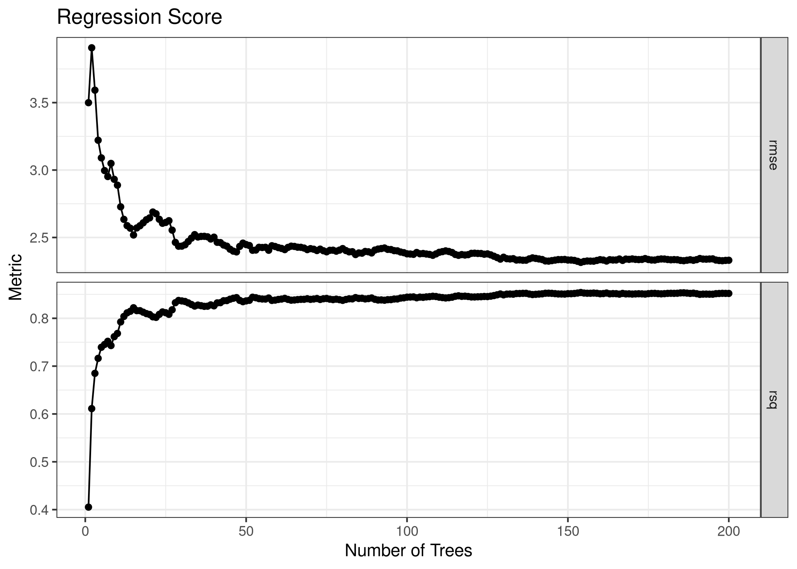

<!-- README.md is generated from README.Rmd. Please edit that file -->

# rangertoolkit

<!-- badges: start -->
<!-- badges: end -->

`Rangertoolkit` is intended to be a collection of convenient utilities
for working with `ranger` random forest models. It currently provides
the `score_oob` function to generate out-of-bag curves for regression,
classification, and survival forests. It uses the `yardstick` package
for evaluation in order to integrate nicely with `tidymodels` and
`tidyverse` work flows.

The [OOBCurve](https://github.com/PhilippPro/OOBCurve) package is an
alternative resource for generating out-of-bag curves for ranger models;
however, it is based around the `mlr` package and does not support
survival models.

## Installation

You can install the development version of `rangertoolkit` like so:

``` r
# update once pushed to a GitHub repository
```

## Examples

### Regression

This is an example of evaluating the out-of-bag error for a regression
model.

``` r
library(rangertoolkit)
library(ggplot2)
set.seed(0)

regression_model <- ranger::ranger(
  mpg ~ .,
  data = mtcars,
  num.trees = 200,
  keep.inbag = TRUE
)
regression_score <- score_oob(
  regression_model,
  mtcars[, -1],
  mtcars[, 1]
)

print(head(regression_score))
#> # A tibble: 6 × 4
#>   num_trees .metric .estimator .estimate
#>       <dbl> <chr>   <chr>          <dbl>
#> 1         1 rmse    standard        3.50
#> 2         2 rmse    standard        3.91
#> 3         3 rmse    standard        3.59
#> 4         4 rmse    standard        3.22
#> 5         5 rmse    standard        3.09
#> 6         6 rmse    standard        3.00
```

``` r
ggplot(regression_score,
       aes(x = num_trees,
           y = .estimate)) +
  geom_point() +
  geom_line() +
  ggtitle("Regression Score") +
  xlab("Number of Trees") +
  ylab("RMSE") +
  theme_bw()
```



### Classification

This is an example of evaluating the out-of-bag error for a
classification model.

``` r
classification_model <- ranger::ranger(
  Species ~ .,
  data = iris,
  num.trees = 200,
  keep.inbag = TRUE
)
classification_score <- score_oob(
  classification_model,
  iris[, -5],
  iris[, 5]
)

print(head(classification_score))
#> # A tibble: 6 × 4
#>   num_trees .metric  .estimator .estimate
#>       <dbl> <chr>    <chr>          <dbl>
#> 1         1 accuracy multiclass     0.946
#> 2         2 accuracy multiclass     0.942
#> 3         3 accuracy multiclass     0.963
#> 4         4 accuracy multiclass     0.960
#> 5         5 accuracy multiclass     0.963
#> 6         6 accuracy multiclass     0.951
```

``` r
ggplot(classification_score,
       aes(x = num_trees,
           y = 1 - .estimate)) +
  geom_point() +
  geom_line() +
  ggtitle("Classification Score") +
  xlab("Number of Trees") +
  ylab("1 - Accuracy") +
  theme_bw()
```


### Survival

This is an example of evaluating the out-of-bag error for a survival
model. This might take some time to run for models with a large number
of unique event times.

``` r
lung_clean <- na.omit(survival::lung)
survival_model <- ranger::ranger(
  survival::Surv(time, status) ~ .,
  data = lung_clean,
  num.trees = 500,
  keep.inbag=TRUE
)
survival_score <- score_oob(
  survival_model,
  lung_clean[, -c(2, 3)],
  survival::Surv(lung_clean$time, lung_clean$status)
)
#> Progress: 1%
#> Progress: 60%

print(head(survival_score))
#> # A tibble: 6 × 4
#>   num_trees .metric              .estimator .estimate
#>       <dbl> <chr>                <chr>          <dbl>
#> 1         1 concordance_survival standard       0.619
#> 2         2 concordance_survival standard       0.627
#> 3         3 concordance_survival standard       0.621
#> 4         4 concordance_survival standard       0.585
#> 5         5 concordance_survival standard       0.599
#> 6         6 concordance_survival standard       0.590
```

``` r
ggplot(survival_score,
       aes(x = num_trees,
           y = 1 - .estimate)) +
  geom_point() +
  geom_line() +
  ggtitle("Survival Score") +
  xlab("Number of Trees") +
  ylab("1 - C-Index") +
  theme_bw()
```


